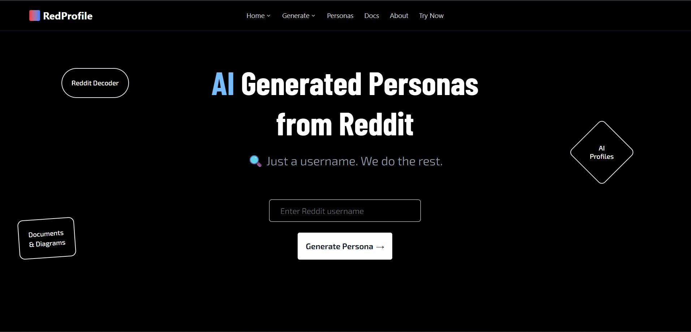
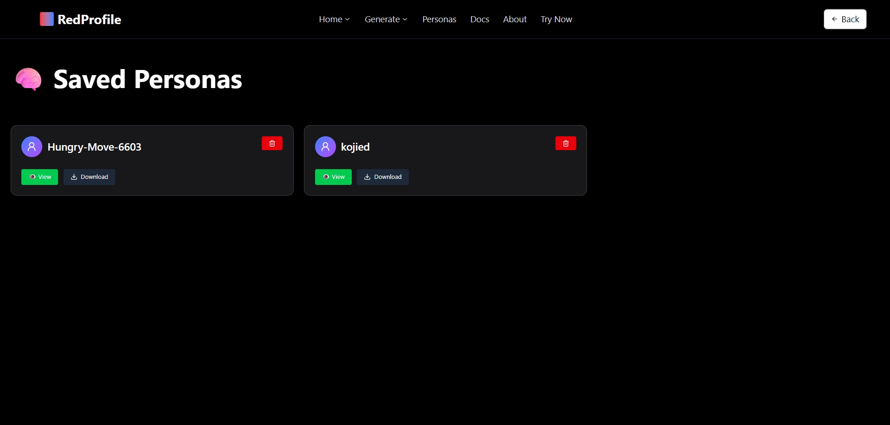
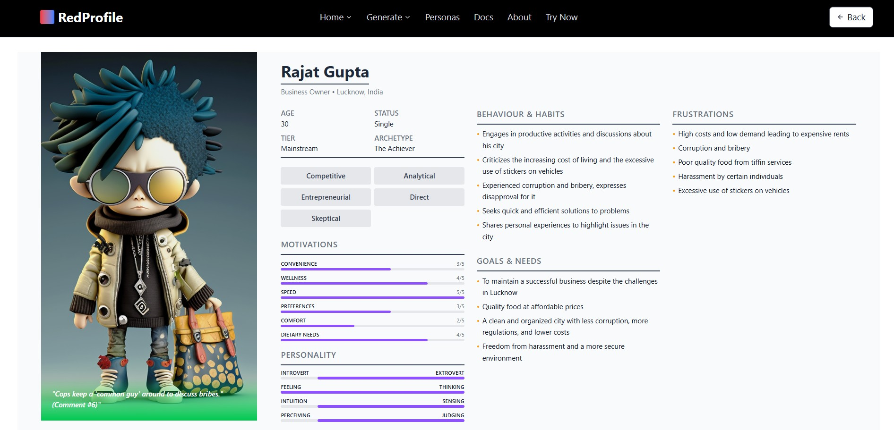

# 🧠 RedProfile — Reddit User Persona Generator

RedProfile is a full-stack tool that analyzes Reddit users and generates structured AI personas.

---

## 📁 Folder Structure

```

beyondchat/
├── backend/       # ✅ FastAPI backend (required)
├── frontend/      # 💡 React frontend (optional)
├── screenshots/       
└── README.md

````

---

## 🚀 Backend Setup (required)

```bash
cd backend

pip install -r requirements.txt
````

### 🔐 Create `.env` in `backend/`:

```
CLIENT_ID=your_reddit_client_id
CLIENT_SECRET=your_reddit_client_secret
USER_AGENT=your_user_agent
OPENROUTER_API_KEY=your_openrouter_api_key
```

### ▶ Run server:

```bash
uvicorn main:app --reload
```

---

## 🧪 Test API (in browser or Postman)

* Generate persona:
  `http://localhost:8000/generate?profile_url=https://www.reddit.com/user/kojied/`

---


## 💻 Frontend (optional)

> Modern UI with React, Tailwind, shadcn/ui, framer-motion

```bash
cd frontend
npm install
npm run dev
```

---

## 📸 UI Preview








## 🚀 Further Enhancements

- Add PDF download functionality for each generated persona.
